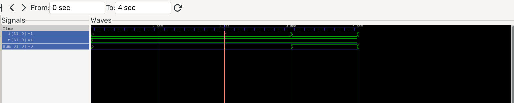

# clogwave - watch variables change with respect to each other

clogwave is an LLVM pass that instruments your C code to generate
a VCD (wave file) of how variables change. 

Consider this example, 

```
int nsum(int n) {
  int sum = 0;
  for (int i = 0; i < n; ++i) {
    sum += i;
  }
  return sum;
}

int main() {
  nsum(4);
}
```

Compile and run this code:

```
clang -g -fpass-plugin=build/libCLogWave.so alt.c
./a.out 
gtkwave clogwave_dump.vcd
```

clogwave generates a VCD dump of the variables when this code is run which can
be viewed in tools like gtkwave. 

Here's what it looks like in gtkwave:



Notice when `i` is 1, `sum` is 0 but when `i` changes in the next iteration, `sum` becomes 3.  With this
visualization, you can view variables in a complex code base (nested loops etc.), cleanly as they change wrt each
other. 

The idea for this pass came as I discovered how RTL devs debugged their code. Since FPGAs and ASICs present
a paradigm where many registers change in a single cycle, viewing all of them in time is a convenient way 
of debugging. The idea of clogwave is to use that convenience for debugging messy C code. Beyond this, 
this idea could also be used to debug programs that use threads.
